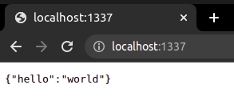

# Task 1 (DB Connectivity)

- Setup your web server with a database connectivity (any application works).

- Setup an authentication to DB using one of the following methods: Basic, Digest, Certificate

- Protect the service from brute force attacks.

## Steps

1. Clone the example repo https://github.com/testdrivenio/flask-on-docker

2. Following the instructions in README to run the production webserver (nginx) with the db (postgres) and the simple app (flask) that connects to nginx through (gunicorn) wsgi.

3. It's a simple webpage showing hello world JSON with endpoints `/static` and `/media` to serve contents from the server, and `/upload` endpoint to upload content.

   

4. We can configure postgres with username/password authentication by modifying `.env.prod.db` and setting up the variables `POSTGRES_USER`, `POSTGRES_PASSWORD`, `POSTGRES_DB` or from the terminal:

   - To add new user do `createuser ahmed`, from `postgres` terminal.
   - To change user password `\password <username>` from `psql` terminal.

5. Malicious users may try to:

   - Send many requests to the web app to take it down (DoS attack)
   - Brute force DB credentials to gain access to the DB (Brute force attack)

6. We will configure `nginx` as a reverse proxy between users and our application and set a call rate limit to lower the risk of the above threats.

7. Add the following lines to the top of `nginx.conf`

   ```
   limit_req_zone $binary_remote_addr zone=ip:10m rate=5r/s;
   ```

   and this one `limit_req zone=ip burst=12 delay=8;` to the configuration of each endpoint.

   This will allow up to 12 excessive requests, the first 8 are served without delay, but further ones are delayed to enforce the rate of 5r/s.

8. Run `ab -n 100 -s 100 http://localhost:1337/` to benchmark the server and make sure our configuration works.

   - This will run 100 request to the `/` endpoint of the server with 100 seconds as the max time to wait before timeout. 

   - We can see that requests were limited to `5.49 request/sec` satisfying our configuration above.

     


# Task 2 (Firewall & IDS/IPS)

- Protect your application using two of the following tools:

  - Network Firewalls; Snort, Suricata

  - Web Application Firewalls: IronBee, WebKnight, Shadow Daemon

  - Honeypot: Glastopf, WebTrap, honeyhttpd

## Steps

- Following the [Getting started section](https://shadowd.zecure.org/overview/shadowd/) to use Shadow Daemon as WAF and honeypot with our flask app.

- Installation:

  ```bash
  sudo apt-get update 
  
  # docker prerequisities
  sudo apt-get install docker docker.io docker-compose
  sudo usermod -aG docker $USER
  newgrp docker
  
  # ShadowDeamon setup
  git clone https://github.com/zecure/shadowdctl.git
  cd shadowdctl
  sudo ./shadowdctl up -d
  sudo ./shadowdctl exec web ./app/console swd:register --name=ahmed --admin
  ```

- Created a profile using the GUI on http://127.0.0.1:8080/ with default settings

- Setting up Python connector:

  ```bash
  git clone https://github.com/zecure/shadowd_python.git
  python3 setup.py install
  ```

- Setting up Flask interceptor by adding the following lines to `app.py`

  ```python
  from shadowd.flask_connector import InputFlask, OutputFlask, Connector
  
  @app.before_request
  def before_req():
      input = InputFlask(request)
      output = OutputFlask()
  
      Connector().start(input, output)
  ```

- Now all the requests are intercepted for filtration by Shadow Daemon.

- To use Shadow Daemon as a honeypot, we enable observe mode in `/etc/shadowd/connectors.ini` to log attacker info undetected and follow the recommended options [here](https://shadowd.zecure.org/tutorials/honeypots/)

# Task 3 (OWASP)

Describe OWASP Top 10 in your own words.

1. **Broken Access Control**: attacker was able to access a resource or perform an action that he/she was not supposed to have access to, due to some misconfiguration from admin, or the deployment of a vulnerable system.
2. **Cryptographic Failures**: attacker was able to access (stored or transmitted) sensitive data due to the cryptographic algorithm not being implemented correctly or is vulnerable. Examples include weak hashing/encryption algorithms, weak/compromised/reused keys, or data transmitted over clear text due to the server not enforcing security rules.
3. **Injection**: attacker was able to send malicious input to a vulnerable system, the input was processed, allowing the attacker to change the course of execution and manipulate the system into doing an unintended behavior (e.g., leaking/corrupting/destroying sensitive data, executing malicious code, or worse).
4. **Insecure Design:** attacker was able to hack into a system because it was vulnerable by design (there was an architectural flaw in the way the system is developed), there was no error from the admin side.
5. **Security Misconfiguration**: attacker was able to hack into a system because of an error from admin side, as opposed to the previous point (e.g., webserver admin didn't enforce the use of https).
6. **Vulnerable and Outdated Components**: attacker was able to exploit a vulnerability in a certain component (OS, DBMS, API), or a dependency (software library) used by the target system, due to the component being vulnerable by design or not being updated.
7. **Identification and Authentication Failures:** attacker was authenticated into a system they were not supposed to access due to the system permitting automated attacks, weak passwords, ineffective credentials recovery process, or other related identification flaws.
8. **Software and Data Integrity Failures**: attacker was able to modify data or software packages due to the system not verifying data integrity properly (e.g., checking digital signatures of certificates, or checksum verifications of data) 
9. **Security Logging and Monitoring Failures:** attacker was able to hack into a system <u>undetected</u> because the system lacks extensive and explanatory logging or the logs were not inspected/monitored carefully, or the alerting mechanism was blind to the attack or very slow to report.
10. **Server-Side Request Forgery:** attacker was able to abuse the server to access or modify internal resources, by deceiving the server into communicating with the untrusted attacker website, this kind of attacks are critical as they bypass firewalls, VPNs, and ACLs.

