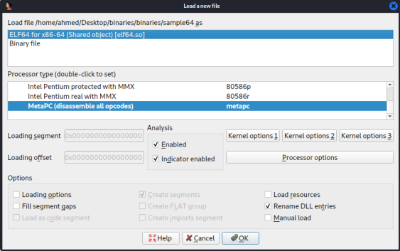
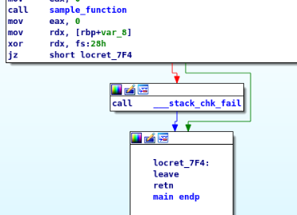

# Lab 5: Software Security

## Preparation

- Installed IDA on Kali VM and copied the binaries there.

- Analyzed the 64bit binary on hybrid-analysis to find that it imposes no threat.

- Sample output in a sand-boxed environment.

  ```bash
  $ ./sample64 
  In main(), x is stored at 0x7ffd43f55a3c.
  In sample_function(), i is stored at 0x7ffd43f55a18.
  In sample_function(), buffer is stored at 0x7ffd43f55a0e.
  Value of i before calling gets(): 0xffffffff
  1000000000000000
  Value of i after calling gets(): 0x303030303030
  ```

- ِA buffer overflow was possible because of the use of `gets` function in C that overwritten the memory address storing the value of `i` when supplying a large-enough number as input.

## Theory

1. **What kind of files did you receive (which arch, 32bit or 64bit). Use "file" Linux command to know the files.**

   - `binaries.zip` contains three files `sample32`, `sample64`, and `sample64-2`

   - Executed `file sample64` and got the following output.

     ```
     sample64: ELF 64-bit LSB pie executable, x86-64, version 1 (SYSV), dynamically linked, interpreter /lib64/ld-linux-x86-64.so.2, for GNU/Linux 3.2.0, BuildID[sha1]=047527792d38bff77ab0d642cd31921bfe9fe1d2, with debug_info, not stripped
     ```

2. **What is ASLR, and why do we need it?**

   - **Address Space Layout Randomization:** a technique used by operating systems to lower the chances of buffer-overflow attacks, by loading system executables into random locations in memory, making it harder for the attacker to guess the location of sensitive data and feed a certain input to the program that exposes such data.

3. **What does stripped binary mean?**

   - A stripped binary is an executable file with debugging information removed (which are not needed for normal execution of the binary).
   - It typically results from running `strip` command on a binary file.
   - It reduces the size of the executable, may result in better performance, and makes it more difficult to disassemble or reverse the binary file. 

4. **What are GOT and PLT?** 

   - Apart from Game of Thrones and Programming Language Theory. 
   - PLT is the **Procedure Linkage Table**: a table in memory used by the dynamic linker to find the addresses of external functions/procedures to call.
   - GOT stands for **Global Offsets Table**: a section in program memory used to run an ELF executable independently from memory where its loaded, by converting symbols in code to their corresponding memory address at runtime.
   - Relocating functions/procedures/libraries and using such tables to find their runtime addresses helps sharing them between programs, avoiding memory address conflicts, and make executables harder to exploit (pwn).

5. **How can the debugger insert a breakpoint in the debugged binary/application?**

   - When compiling binaries, we need to include debugging information (e.g., for GCC, we compile code with `-g` flag to include such information).
   -  A debugger (e.g., GDB) then uses such information to place breakpoints that block code execution at certain lines and dumps current memory information to help with code analysis and fixing problems.

## Reversing

- Disabled ASLR to make reversing binaries easier 

  `sudo sysctl -w kernel.randomize_va_space=0`

- Loaded `sample64` and `sample32` into IDA



- Program starting point (main) assembly code in both architectures.

  

### Function prologue and epilogue

- `sample_function` prologue in 32-bit binary

  ```assembly
  push    ebp       ; Preserve base pointer to return
  mov     ebp, esp  ; Base pointer now points to the stack top
  push    ebx       
  sub     esp, 14h  ; Allocate 20 bytes for locals on the stack
  ```

- `sample_function` prologue in 64-bit binary

  ```assembly
  push    rbp
  mov     rbp, rsp
  sub     rsp, 20h
  ```

- `rbp` and `rsp` are the 64-bit equivalents to `ebp` and `esp`

- Epilogue didn't differ, both binaries used x86 assembly instructions `leave` and `retn`

### Function call and argument passing

- Function calls used `call sample_function` assembly instruction in both architectures.
- `sample_function` didn't require arguments, but if it did, the difference would be to the use of `mov`  with `eax` and `ebx` to pass such arguments in 32-bit architecture and their equivalent `rax` and `rbx` in 64-bit.

### ldd command

- list dynamic dependencies (ldd) is a command in unix to print the shared libraries required by a given binary file (passed as an argument).

- Output

  ```bash
  $ ldd sample32
  	linux-gate.so.1 (0xf7fc9000)
      libc.so.6 => /lib32/libc.so.6 (0xf7db9000)
  	/lib/ld-linux.so.2 (0xf7fcb000)
  	
  $ ldd sample64
  	linux-vdso.so.1 (0x00007ffff7fca000)
      libc.so.6 => /lib/x86_64-linux-gnu/libc.so.6 (0x00007ffff7be6000)
      /lib64/ld-linux-x86-64.so.2 (0x00007ffff7fcc000)
  ```

### `sample64-2` binary

- In the modified 64-bit binary, `i` was stored in a memory location lower than the buffer, so the buffer overflow won't overwrite the memory location of `i`, unlike the original `sample64`
- The modified binary also includes a buffer-overflow protection `call __stack_chk_fail` that works like this:
  - A canary (detector) value is placed after the buffer.
  - When a large enough input is supplied, the canary value is overwritten.
  - This causes the program to detect (and output) the "stack smashing" then terminate, preventing an attacker from exploiting the binary further.



